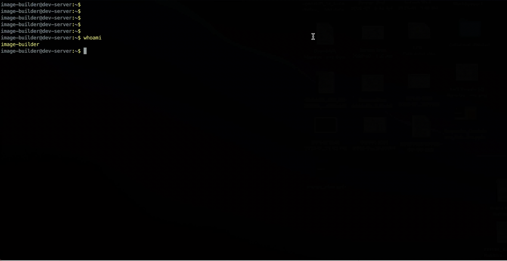

# Image Build


## Rocky Linux 8.7 EKS Image

The screen-capture below walks through the image-build process. There are four files which are edited/added in the walkthrough below and the same can be found in the rockylinux-8.7 directory of this repository, just swap the original files with the files in this repository rather editing each line as shown in the video.

**The Video URL redirects to a video hosting site (Vimeo)

[](https://vimeo.com/784925919)

### Build Steps


1. The First section of video shows running a command ```sudo image-builder build --os ubuntu --hypervisor baremetal --release-channel 1-24```, this command clones all the necessary repositories and set the build environment, by default once it is set it initiates the build of Ubuntu based image which is not needed in this case. Users can just bail out (CTRL+C) from the process as shown in the video which will provide all the necessary repositories in-place.


2. Below are the two packer utility commands that are used for building the images. These are the same scripts that are used in the sceree-capture above.

* Make sure to indicate the right path in all the paths to the tooling directory in the caommand below, for example absolute path: ```/home/image-builder/jma-image-build//home/image-builder/jma-image-build/```

```
sudo build/setup_packer_configs.sh 1-24 raw rockylinux s3://projectbuildpipeline-857-pipelineoutputartifactsb-10ajmk30khe3f /home/image-builder/jma-image-build/eks-anywhere-build-tooling/projects/kubernetes-sigs/image-builder/_output/tar/1-24/raw/rockylinux/ 1-23 latest image-builder/images/capi
```

* Make sure to indicate the right path in all the paths to the tooling directory in the caommand below, for example absolute path: ```/home/image-builder/jma-image-build//home/image-builder/jma-image-build/```

```
sudo PACKER_FLAGS="-force" PACKER_LOG=1 PACKER_LOG_PATH=/home/image-builder/jma-image-build/eks-anywhere-build-tooling/projects/kubernetes-sigs/image-builder/_output/tar/1-24/raw/rockylinux/packer.log PACKER_VAR_FILES="/home/image-builder/jma-image-build/eks-anywhere-build-tooling/projects/kubernetes-sigs/image-builder/_output/1-24/raw/rockylinux/config/kubernetes.json /home/image-builder/jma-image-build/eks-anywhere-build-tooling/projects/kubernetes-sigs/image-builder/_output/1-24/raw/rockylinux/config/common.json /home/image-builder/jma-image-build/eks-anywhere-build-tooling/projects/kubernetes-sigs/image-builder/_output/1-24/raw/rockylinux/config/cni.json /home/image-builder/jma-image-build/eks-anywhere-build-tooling/projects/kubernetes-sigs/image-builder/_output/1-24/raw/rockylinux/config/additional_components.json " make -C image-builder/images/capi build-raw-rockylinux-8
```


